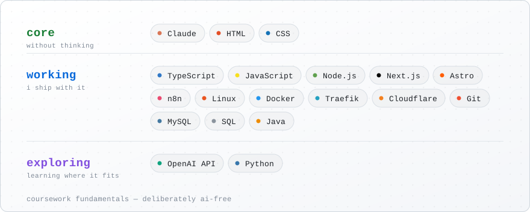

<picture>
  <source media="(prefers-color-scheme: dark)" srcset="assets/hero-dark.svg">
  <source media="(prefers-color-scheme: light)" srcset="assets/hero-light.svg">
  
</picture>

  <a href="https://rogertito.com"><b>Portfolio</b></a>
  &nbsp;&nbsp;·&nbsp;&nbsp;
  <a href="https://www.linkedin.com/in/roger-tito-farez-035ab626b/"><b>LinkedIn</b></a>
  &nbsp;&nbsp;·&nbsp;&nbsp;
  <a href="mailto:crtitofarez@gmail.com"><b>crtitofarez@gmail.com</b></a>

## 01 · about

I build internal tools and workflow automations with **Claude in the loop** — and I treat AI as a tool to supervise, not a shortcut to skip thinking.

The honest version: the model writes roughly 90% of the keystrokes. The remaining 10% is where the work actually is — scoping the problem, choosing what's worth shipping, debugging what the model got wrong, and making sure I still understand every line that ends up in `main`.

First year of the DAW programme in Barcelona (2025–2027). In 2026 I won **MetropolisFPLab** with Training Hub, an internal training-analytics platform built for the pharmaceutical group mesoestetic. Outside class I run my own Linux VPS and build internal tools on Next.js and Astro.

> [!NOTE]
> Most repositories are private while in development. I'm happy to walk through any of them line by line in a call — including what Claude drafted and what I deliberately kept for myself.

## 02 · selected work

|  | project | status | stack |
|:--|:--|:--|:--|
| `001` | **Training Hub** — for mesoestetic | 🏆 `MetropolisFPLab 2026 winner` | Next.js · TypeScript |
| `002` | **Forever Events** | `shipped` · May 2026 | PHP · MySQL · JS |
| `003` | **rogertito.com** | `shipped` · Apr 2026 | Astro · TypeScript · Tailwind |
| `004` | **Self-hosted observability stack** | `in dev` · Apr 2026 | Docker · Traefik · Linux |

 

### `001` Training Hub — mesoestetic

**🏆 Winner, MetropolisFPLab 2026.** Built for mesoestetic, a pharmaceutical group.

**The brief:** the company spends thousands of hours a year on staff training and has no reliable way to know whether any of it changes how people actually work.

Implementation details are confidential to the client engagement. Happy to talk through my role and the reasoning behind the approach in a call.

`Next.js` `TypeScript`

### `002` Forever Events

Four-person event-management platform built on a hand-rolled PHP MVC structure — no framework. Authentication, profile management and the full event lifecycle.

`PHP` `MySQL` `HTML` `CSS` `JavaScript`

### `003` rogertito.com

My portfolio, rebuilt from scratch as an honest counter to the generic AI-styled developer site. Static output with a single JS island, and a token-based design system — Tailwind v4 mapped onto custom CSS variables, theme-aware throughout, with view transitions that survive a theme swap.

`Astro` `TypeScript` `Tailwind CSS` `Cloudflare Workers & Pages`

### `004` Self-hosted observability stack

Real-time monitoring, alerting and access control for my Hostinger VPS, without a SaaS bill. Around ten containers behind an edge proxy doing TLS and rate limiting, bcrypt auth on every dashboard, and only `:80` and `:443` reachable from outside.

`Docker` `Traefik` `Beszel` `Uptime Kuma` `Dozzle` `Linux (Ubuntu)`

## 03 · stack

<picture>
  <source media="(prefers-color-scheme: dark)" srcset="assets/stack-dark.svg">
  <source media="(prefers-color-scheme: light)" srcset="assets/stack-light.svg">
  
</picture>

Diagram generated by [`assets/gen_stack.py`](assets/gen_stack.py) — the tier list is the source of truth, the layout is computed.

## 04 · education

| | |
|:--|:--|
| **CFGS Desarrollo de Aplicaciones Web (DAW)** | Barcelona · 2025–2027 · first year |

Fundamentals during coursework are done **deliberately AI-free**. If I can't write it myself, I don't claim it.

## 05 · contact

Looking for an **internship or junior role** on a team that ships AI-assisted products and treats engineering quality as part of the product, not a phase that comes after.

Barcelona — on-site, hybrid or remote. Available from summer 2026.

I usually reply within a day or two. Reach out even if the fit isn't obvious.

  <a href="mailto:crtitofarez@gmail.com"><b>crtitofarez@gmail.com</b></a>
  &nbsp;&nbsp;·&nbsp;&nbsp;
  <a href="https://www.linkedin.com/in/roger-tito-farez-035ab626b/"><b>LinkedIn</b></a>
  &nbsp;&nbsp;·&nbsp;&nbsp;
  <a href="https://rogertito.com"><b>rogertito.com</b></a>

